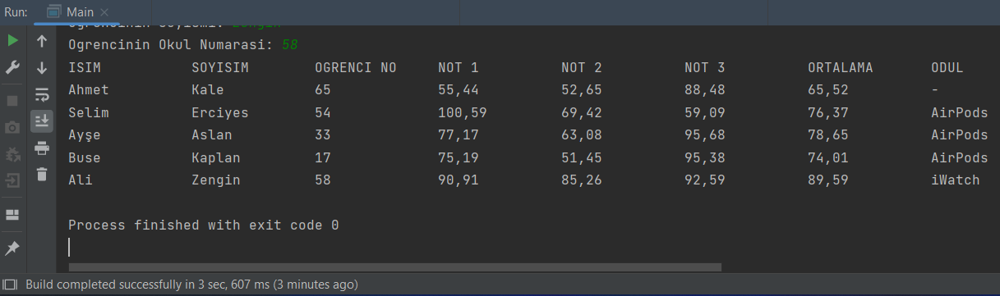

# student-information-system
It takes the student's name, surname and id from the user. Grades are given randomly to students whose information is entered. And the average is calculated and the prize he wins is determined.

## Prerequisites
This project requires JDK

## Setup/Installation
1. Clone this repo into your own workspace.
2. Open the project using IDEA or VS Code
3.  Run

